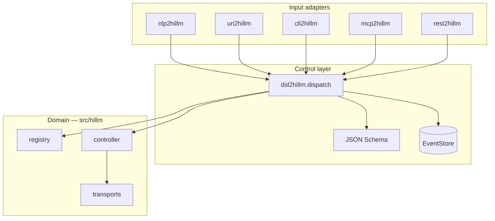

# Control layer (`*2hillm`)

Thin adapters around `dsl2hillm.dispatch()` — same pattern as [`tillm/packages/*2tillm`](../../tillm/packages/) and [`gillm/packages/*2gillm`](../../gillm/packages/).

Domain logic (registry, controller, transports) stays in `src/hillm/`.

## Packages

| Package | Role | Port |
| --- | --- | --- |
| **dsl2hillm** | DSL + JSON Schema + CQRS bus | — |
| **uri2hillm** | `hillm://` or DSL shorthand → `dispatch()` | — |
| **nlp2hillm** | NL → DSL; `--apply` = dispatch | — |
| **cli2hillm** | Shell / hillm CLI passthrough | — |
| **mcp2hillm** | MCP stdio tools | — |
| **rest2hillm** | FastAPI `/v1/dsl` | **8218** |

Package READMEs: [packages/README.md](../packages/README.md)

## Install (dev)

```bash
make install-dev
# or
bash packages/install-dev.sh
```

## DSL verbs

| Type | Verbs |
| --- | --- |
| Query | `HEALTH`, `DEVICES`, `ORIENT`, `ACTIONS`, `VALIDATE`, `READ`, `STATUS`, `RESOLVE` |
| Command | `WRITE`, `ACTUATE`, `CONNECT`, `DISCONNECT`, `EXECUTE` |

Example:

```text
HEALTH
READ DEVICE sensor-temp DRY_RUN true
WRITE DEVICE actuator-relay VALUE 1 REGISTER coil:0 DRY_RUN true
ACTUATE DEVICE display-primary ACTION on
```

## Adapters

```bash
# DSL CLI
dsl2hillm HEALTH
dsl2hillm 'READ DEVICE sensor-temp DRY_RUN true'

# URI — full hillm:// URI or DSL shorthand
uri2hillm HEALTH
uri2hillm READ DEVICE sensor-temp DRY_RUN true
uri2hillm 'hillm://cmd/READ?device=camera-usb&dry_run=true'
uri2hillm decode READ DEVICE sensor-temp
uri2hillm run HEALTH

# NLP
nlp2hillm "read temperature from serial" --apply

# Shell passthrough
cli2hillm exec devices

# REST (pair with rest2gillm :8220, rest2tillm :8216)
rest2hillm serve --port 8218
curl -X POST http://127.0.0.1:8218/v1/dsl -d HEALTH

# MCP
mcp2hillm serve
```

## URI shape

```
hillm://cmd/{VERB}?device=...&register=...&dry_run=true
```

`uri2hillm` accepts:

1. Full `hillm://` URI (for nlp2uri and automation)
2. DSL shorthand (`HEALTH`, `READ DEVICE sensor-temp DRY_RUN true`)

Bare verbs like `READ` without `DEVICE` return a schema validation error (not a URI parse error).

Details: [packages/uri2hillm/README.md](../packages/uri2hillm/README.md)

## nlp2uri integration

When `nlp2uri[hillm]` is installed, `compile_uri_to_actions("hillm://...")` returns
`OSAction(host, "uri2hillm", [uri])`.

Examples: [examples/nlp2uri/](../examples/nlp2uri/)

## Architecture



**See also:** [configuration.md](configuration.md) · [examples/control-layer/](../examples/control-layer/) · [TODO.md](../TODO.md)
